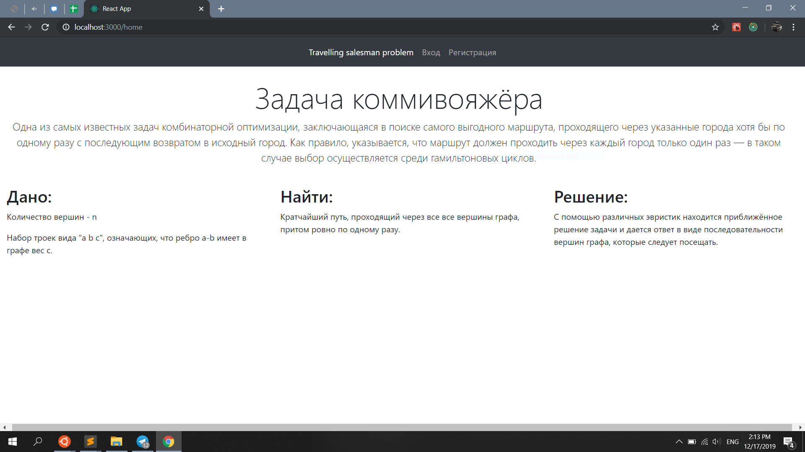
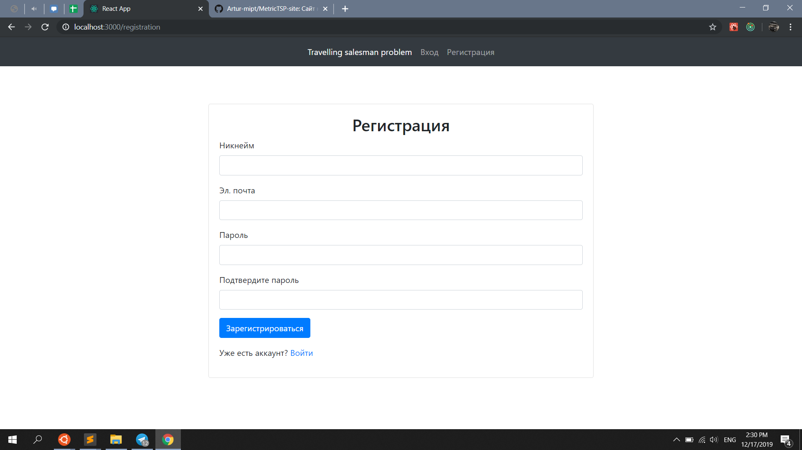
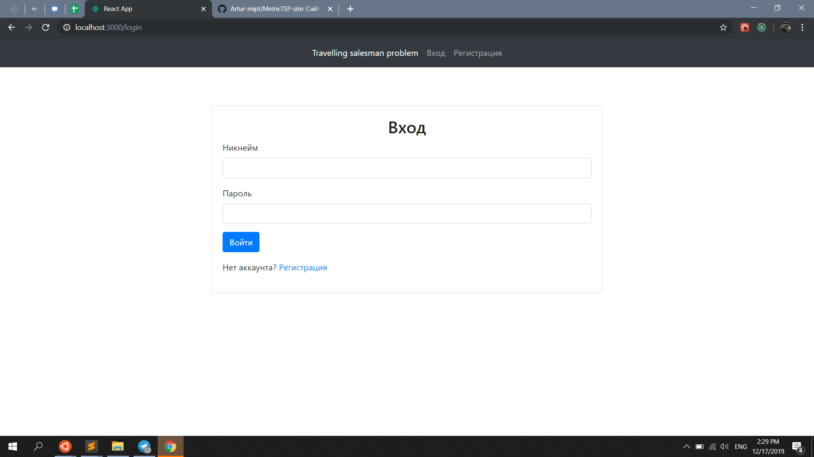
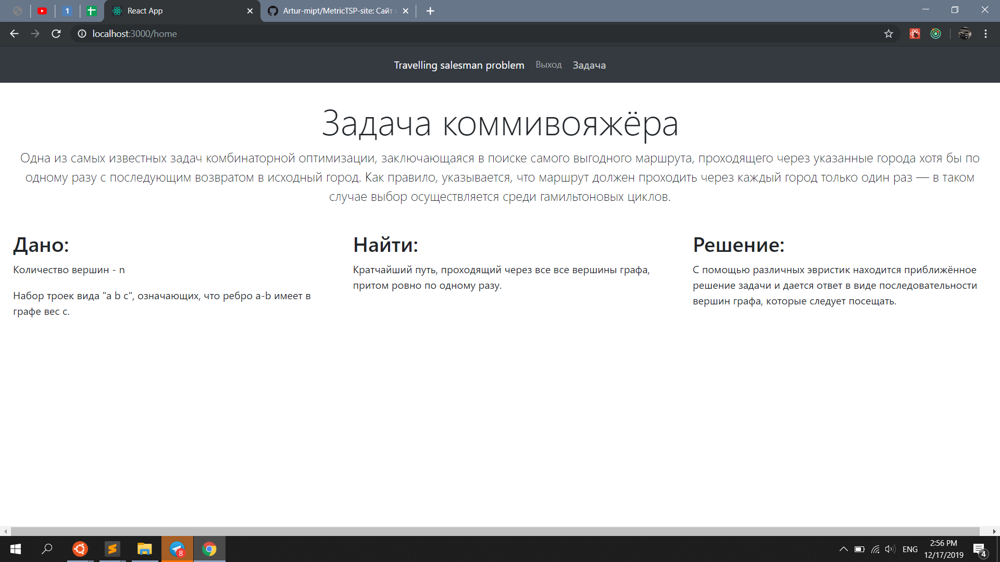
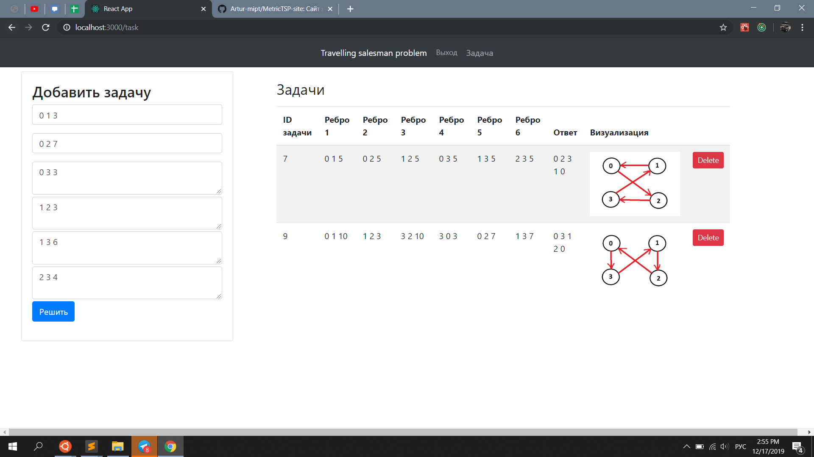
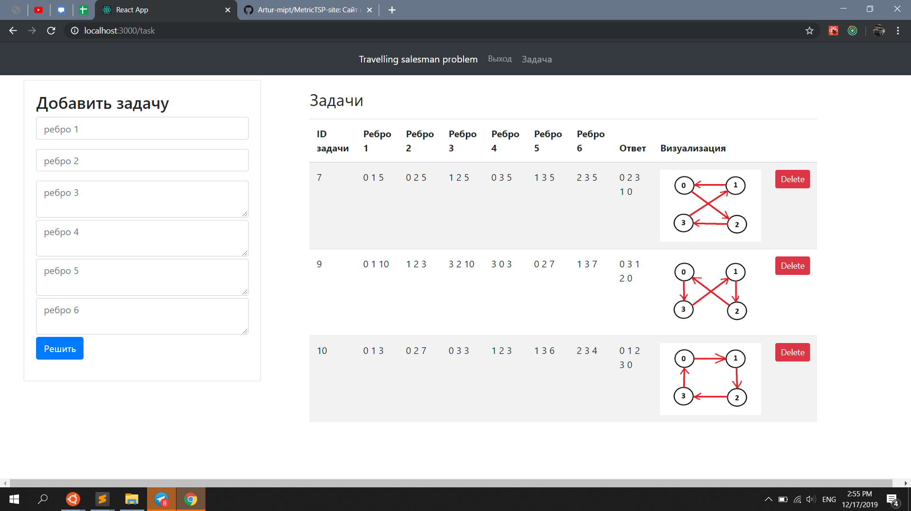

## Главный экран

Описание задачи.

## Страница регистрации

Заполняем форму, нажимаем "зарегистрироваться".

## Страница входа

Заполняем форму, нажимаем "войти".

## Главный экран после авторизации

Так же описание задачи, но теперь в панели навигации доступны кнопки "выход" и "задачи".

## Страница с задачами

Возможность решения доступна только авторизованным пользователям. Для каждого пользователя хранится список задач, которые он решал. Добавить новую задачу можно, введя 6 рёбер графа в форму "добавить задачу".

Для примера решим задачу для следующего графа на вершинах 0, 1, 2, 3: длина ребра 0-1 равна 3 (первое поле), длина ребра 0-2 равна 7, длина ребра 0-3 равна 3, длина ребра 1-2 равна 3, длина ребра 1-3 равна 6, длина ребра 2-3 равна 4.

## Результат решения

После нажатия кнопки "решить" в список задач добавляется только что введённая нами задача, для неё выводится ответ и его визуализация: в нашем случае решением задачи будет по очереди посетить вершины 0 1 2 3. Другие примеры так же можно найти на скриншоте.

## Описание кода

Backend: ключевой является модель Task в models.py, она хранит в себе набор рёбер, ответ и его визуализацию. Ответ считается при сериализации, для этого я написал отдельный класс MetricTSP, решающий задачу для графа, представленного в виде numpy-массива.

Frontend: запросы на бэкенд отправляются с помощью axios, они реализованы в папке actions (там есть запросы для авторизации, регистрации, выхода из аккаунта и получения решения задачи). В папке Home хранятся компоненты для отрисовки панели навигации и главной страницы, в папке Task - для отрисовки страницы с задачами, в папке User - для страниц регистрации и входа. Для отслеживания хода решения задачи и статуса пользователя (USER_LOADING, AUTHORIZED и т.д.) в actions/types.js прописаны типы, которые меняются в папке reducers для каждой компоненты по-разному. 
